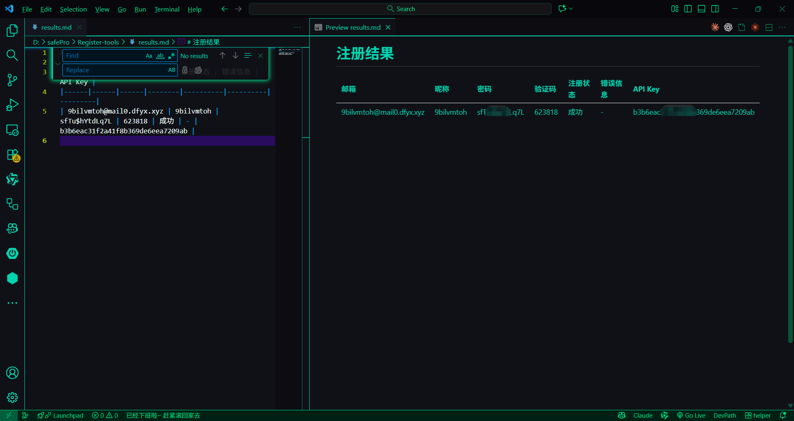

# DayDayMap 自动注册机

这是一个用于自动注册 DayDayMap 网站账号的脚本。该脚本使用 Selenium 自动化浏览器操作，实现以下功能：

## 功能特点

1. 自动获取临时邮箱地址（通过 http://mail0.dfyx.xyz/）
2. 自动获取邮箱中的验证码
3. 自动处理昵称（基于邮箱前缀，确保符合长度4-16位，仅包含汉字、字母、数字和下划线）
4. 随机生成8-30位安全密码（包含大小写字母、数字和特殊字符）
5. 自动填写注册表单并提交
6. 优化的注册按钮点击策略（多种定位器组合、标准点击和JavaScript点击尝试）
7. 专门的SVG复制按钮处理功能
8. 自动提取API Key
9. 将注册结果保存到 results.md 文件中

## 安装依赖

1. 确保已安装 Python 3.6 或更高版本
2. 安装所需的 Python 包：

```bash
pip install -r requirements.txt
```

3. 确保已安装 Google Chrome 浏览器

## 使用方法

1. 运行注册脚本：

```bash
python register_bot.py
```

2. 脚本会自动打开 Chrome 浏览器，执行注册流程
3. 注册结果会被保存到 results.md 文件中

## 注意事项

- 本脚本仅供学习和测试使用
- 使用前请确保网络连接正常
- 如果网站结构有变化，可能需要更新脚本中的选择器
- 验证码获取可能需要一定时间，请耐心等待

## 结果文件说明

results.md 文件以 Markdown 表格格式包含以下信息：

- 邮箱：注册使用的临时邮箱地址
- 昵称：处理后的符合要求的昵称
- 密码：生成的安全密码
- 验证码：从邮箱获取的验证码
- 注册状态：注册成功或失败
- 错误信息：如果注册失败，显示具体错误信息
- API Key：成功注册后获取的API密钥

## 结果预览

以下是结果文件的可视化预览：



## TODO 计划

1. 🔍 支持轮询apikey进行网络空间资产测绘（每个账号免费500积分*N）
2. 👥 支持多账户批量注册（暂时不开放，保护网站人人有责）
3. 🧹 优化代码，移除冗余试错环节
4. 🖱️ 优化滑动验证码（尽量全自动无需人类干预）